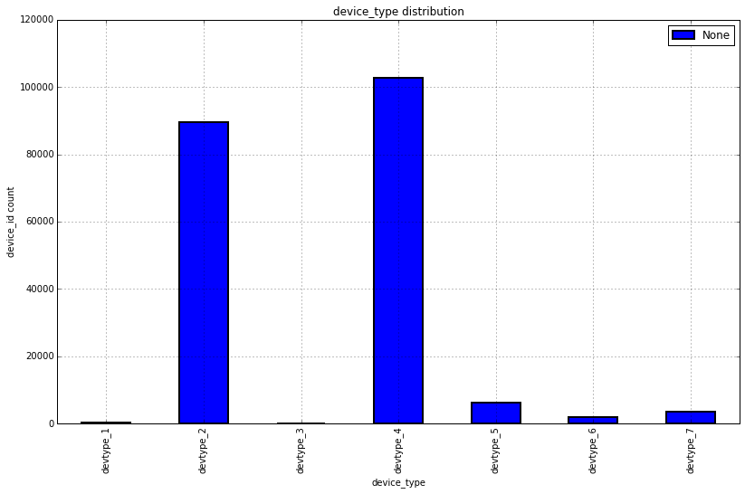

    %pylab inline

    Populating the interactive namespace from numpy and matplotlib

    ls data/

    cookie_all_basic.csv  id_all_ip.csv        property_category.csv
    dev_test_basic.csv    id_all_property.csv  sampleSubmission.csv
    dev_train_basic.csv   ipagg_all.csv        stale/

    import pandas as pd
    from itertools import groupby, count
    _figsize = (13.5,8)

    cookie_all_basic = pd.read_csv('data/cookie_all_basic.csv')
    dev_train_basic = pd.read_csv('data/dev_train_basic.csv')
    dev_test_basic = pd.read_csv('data/dev_test_basic.csv')
    ipagg_all = pd.read_csv('data/ipagg_all.csv')
    sampleSubmission = pd.read_csv('data/sampleSubmission.csv')
    #  = pd.read_csv('')

    property_category = pd.read_csv('data/property_category.csv')
    id_all_ip = pd.read_csv('data/id_all_ip.csv')
    id_all_property = pd.read_csv('data/id_all_property.csv')

    dev_all = pd.concat([dev_test_basic, dev_train_basic], ignore_index=True)
    print dev_test_basic.shape[0], dev_train_basic.shape[0], dev_all.shape[0]

    61156 142770 203926

    # print "unique devices: \n%s " % ('\n'.join(["%d. %s" % (i, j) for i, j in enumerate(dev_all.device_type.unique())]))
    # print "\nunique dev types: \n%s " % (["%d. %s" % (i, j) for i, j in enumerate(dev_all.device_os.unique())])
    uniq_dev_types = dev_all.device_type.unique()
    uniq_dev_os = dev_all.device_os.unique()
    uniq_country = dev_all.country.unique()
    uniq_drawbridge_handle_train =  dev_all.drawbridge_handle.unique()
    print "unique device types: %s " % (len(np.delete(uniq_dev_types, np.where(uniq_dev_types == '-1'))))
    print "unique device OS types: %s " % (len(np.delete(uniq_dev_os, np.where(uniq_dev_os == '-1'))))
    print "unique device countries: %s " % (len(np.delete(uniq_country, np.where(uniq_country == '-1'))))
    print "unique train drawbridge handles: %s " % (len(np.delete(uniq_drawbridge_handle_train, np.where(uniq_drawbridge_handle_train == -1))))

    unique device types: 7 
    unique device OS types: 88 
    unique device countries: 148 
    unique train drawbridge handles: 139419 

    # def as_range(iterable):
    #     l = list(iterable)
    #     if len(l) > 1:
    #         return (l[0], l[-1])
    #     else:
    #         return l[0]
        
    # [as_range(g) for _, g in groupby(dev_all.drawbridge_handle, key=lambda n, c=count(): n-next(c))]
    
    s = dev_all.groupby("device_type").agg(lambda x:len(x.unique()))
    # s
    s = s.drop(s.index[0]).reset_index()
    ax = s.plot(x='device_type', y='device_id', 
                lw=2, title='device_type distribution', 
                figsize = _figsize, kind='bar')
    ax.set_ylabel("device_id count")

    <matplotlib.text.Text at 0x7faca5553850>

    # "anonymous_c1_1307" in dev_train_basic.anonymous_c1
    dev_all

<table border="1" class="dataframe">
  <thead>
    <tr style="text-align: right;">
      <th></th>
      <th>drawbridge_handle</th>
      <th>device_id</th>
      <th>device_type</th>
      <th>device_os</th>
      <th>country</th>
      <th>anonymous_c0</th>
      <th>anonymous_c1</th>
      <th>anonymous_c2</th>
      <th>anonymous_5</th>
      <th>anonymous_6</th>
      <th>anonymous_7</th>
    </tr>
  </thead>
  <tbody>
    <tr>
      <th>0</th>
      <td>-1</td>
      <td>id_1</td>
      <td>devtype_2</td>
      <td>devos_72</td>
      <td>country_146</td>
      <td>1</td>
      <td>-1</td>
      <td>-1</td>
      <td>52</td>
      <td>1</td>
      <td>204</td>
    </tr>
    <tr>
      <th>1</th>
      <td>-1</td>
      <td>id_100002</td>
      <td>devtype_4</td>
      <td>devos_7</td>
      <td>country_146</td>
      <td>1</td>
      <td>anonymous_c1_322</td>
      <td>anonymous_c2_3059</td>
      <td>7</td>
      <td>1</td>
      <td>149</td>
    </tr>
    <tr>
      <th>2</th>
      <td>-1</td>
      <td>id_1000035</td>
      <td>devtype_4</td>
      <td>devos_68</td>
      <td>country_146</td>
      <td>-1</td>
      <td>anonymous_c1_814</td>
      <td>anonymous_c2_1918</td>
      <td>17</td>
      <td>106</td>
      <td>201</td>
    </tr>
    <tr>
      <th>3</th>
      <td>-1</td>
      <td>id_1000099</td>
      <td>devtype_2</td>
      <td>devos_159</td>
      <td>country_146</td>
      <td>0</td>
      <td>anonymous_c1_736</td>
      <td>-1</td>
      <td>19</td>
      <td>1</td>
      <td>203</td>
    </tr>
    <tr>
      <th>4</th>
      <td>-1</td>
      <td>id_1000294</td>
      <td>devtype_4</td>
      <td>devos_119</td>
      <td>country_146</td>
      <td>-1</td>
      <td>anonymous_c1_261</td>
      <td>anonymous_c2_17508</td>
      <td>19</td>
      <td>147</td>
      <td>204</td>
    </tr>
    <tr>
      <th>5</th>
      <td>-1</td>
      <td>id_1000305</td>
      <td>devtype_4</td>
      <td>devos_68</td>
      <td>country_146</td>
      <td>-1</td>
      <td>anonymous_c1_144</td>
      <td>anonymous_c2_29201</td>
      <td>8</td>
      <td>1</td>
      <td>203</td>
    </tr>
    <tr>
      <th>6</th>
      <td>-1</td>
      <td>id_1000310</td>
      <td>devtype_2</td>
      <td>devos_36</td>
      <td>country_146</td>
      <td>-1</td>
      <td>anonymous_c1_510</td>
      <td>anonymous_c2_15003</td>
      <td>18</td>
      <td>11</td>
      <td>204</td>
    </tr>
    <tr>
      <th>7</th>
      <td>-1</td>
      <td>id_1000414</td>
      <td>devtype_2</td>
      <td>devos_157</td>
      <td>country_146</td>
      <td>1</td>
      <td>anonymous_c1_255</td>
      <td>anonymous_c2_26303</td>
      <td>16</td>
      <td>1</td>
      <td>202</td>
    </tr>
    <tr>
      <th>8</th>
      <td>-1</td>
      <td>id_1000497</td>
      <td>devtype_4</td>
      <td>devos_114</td>
      <td>country_146</td>
      <td>-1</td>
      <td>anonymous_c1_255</td>
      <td>anonymous_c2_1927</td>
      <td>16</td>
      <td>18</td>
      <td>204</td>
    </tr>
    <tr>
      <th>9</th>
      <td>-1</td>
      <td>id_1000594</td>
      <td>devtype_4</td>
      <td>devos_68</td>
      <td>country_146</td>
      <td>-1</td>
      <td>anonymous_c1_688</td>
      <td>anonymous_c2_30854</td>
      <td>4</td>
      <td>1</td>
      <td>188</td>
    </tr>
    <tr>
      <th>10</th>
      <td>-1</td>
      <td>id_1000689</td>
      <td>devtype_2</td>
      <td>devos_72</td>
      <td>country_146</td>
      <td>0</td>
      <td>anonymous_c1_1296</td>
      <td>anonymous_c2_6217</td>
      <td>26</td>
      <td>25</td>
      <td>204</td>
    </tr>
    <tr>
      <th>11</th>
      <td>-1</td>
      <td>id_1000709</td>
      <td>devtype_2</td>
      <td>devos_36</td>
      <td>country_201</td>
      <td>-1</td>
      <td>anonymous_c1_13</td>
      <td>-1</td>
      <td>9</td>
      <td>113</td>
      <td>191</td>
    </tr>
    <tr>
      <th>12</th>
      <td>-1</td>
      <td>id_1000741</td>
      <td>devtype_4</td>
      <td>devos_119</td>
      <td>country_146</td>
      <td>-1</td>
      <td>anonymous_c1_365</td>
      <td>anonymous_c2_29085</td>
      <td>3</td>
      <td>11</td>
      <td>188</td>
    </tr>
    <tr>
      <th>13</th>
      <td>-1</td>
      <td>id_100079</td>
      <td>devtype_4</td>
      <td>devos_68</td>
      <td>country_146</td>
      <td>-1</td>
      <td>-1</td>
      <td>-1</td>
      <td>3</td>
      <td>1</td>
      <td>198</td>
    </tr>
    <tr>
      <th>14</th>
      <td>-1</td>
      <td>id_1000824</td>
      <td>devtype_2</td>
      <td>devos_34</td>
      <td>country_146</td>
      <td>0</td>
      <td>anonymous_c1_176</td>
      <td>anonymous_c2_7200</td>
      <td>52</td>
      <td>32</td>
      <td>204</td>
    </tr>
    <tr>
      <th>15</th>
      <td>-1</td>
      <td>id_1000868</td>
      <td>devtype_4</td>
      <td>devos_68</td>
      <td>country_146</td>
      <td>0</td>
      <td>anonymous_c1_648</td>
      <td>anonymous_c2_30026</td>
      <td>41</td>
      <td>46</td>
      <td>204</td>
    </tr>
    <tr>
      <th>16</th>
      <td>-1</td>
      <td>id_1000918</td>
      <td>devtype_4</td>
      <td>devos_119</td>
      <td>country_146</td>
      <td>1</td>
      <td>anonymous_c1_1234</td>
      <td>anonymous_c2_4674</td>
      <td>22</td>
      <td>1</td>
      <td>204</td>
    </tr>
    <tr>
      <th>17</th>
      <td>-1</td>
      <td>id_100095</td>
      <td>devtype_2</td>
      <td>devos_36</td>
      <td>country_146</td>
      <td>1</td>
      <td>anonymous_c1_1068</td>
      <td>anonymous_c2_30178</td>
      <td>5</td>
      <td>1</td>
      <td>173</td>
    </tr>
    <tr>
      <th>18</th>
      <td>-1</td>
      <td>id_1000964</td>
      <td>devtype_2</td>
      <td>devos_36</td>
      <td>-1</td>
      <td>0</td>
      <td>-1</td>
      <td>-1</td>
      <td>3</td>
      <td>11</td>
      <td>185</td>
    </tr>
    <tr>
      <th>19</th>
      <td>-1</td>
      <td>id_1001391</td>
      <td>devtype_4</td>
      <td>devos_119</td>
      <td>country_146</td>
      <td>1</td>
      <td>-1</td>
      <td>-1</td>
      <td>3</td>
      <td>1</td>
      <td>194</td>
    </tr>
    <tr>
      <th>20</th>
      <td>-1</td>
      <td>id_1001532</td>
      <td>devtype_2</td>
      <td>devos_57</td>
      <td>country_146</td>
      <td>0</td>
      <td>anonymous_c1_1365</td>
      <td>anonymous_c2_468</td>
      <td>48</td>
      <td>4</td>
      <td>204</td>
    </tr>
    <tr>
      <th>21</th>
      <td>-1</td>
      <td>id_100160</td>
      <td>devtype_4</td>
      <td>devos_119</td>
      <td>country_146</td>
      <td>-1</td>
      <td>anonymous_c1_156</td>
      <td>-1</td>
      <td>8</td>
      <td>1</td>
      <td>186</td>
    </tr>
    <tr>
      <th>22</th>
      <td>-1</td>
      <td>id_1001657</td>
      <td>devtype_4</td>
      <td>devos_68</td>
      <td>country_146</td>
      <td>-1</td>
      <td>-1</td>
      <td>-1</td>
      <td>23</td>
      <td>1</td>
      <td>191</td>
    </tr>
    <tr>
      <th>23</th>
      <td>-1</td>
      <td>id_1001701</td>
      <td>devtype_2</td>
      <td>devos_36</td>
      <td>country_146</td>
      <td>1</td>
      <td>anonymous_c1_331</td>
      <td>anonymous_c2_14675</td>
      <td>4</td>
      <td>4</td>
      <td>204</td>
    </tr>
    <tr>
      <th>24</th>
      <td>-1</td>
      <td>id_1001954</td>
      <td>devtype_4</td>
      <td>devos_68</td>
      <td>country_146</td>
      <td>0</td>
      <td>anonymous_c1_60</td>
      <td>anonymous_c2_15026</td>
      <td>9</td>
      <td>1</td>
      <td>185</td>
    </tr>
    <tr>
      <th>25</th>
      <td>-1</td>
      <td>id_1002053</td>
      <td>devtype_2</td>
      <td>devos_157</td>
      <td>country_146</td>
      <td>1</td>
      <td>anonymous_c1_136</td>
      <td>anonymous_c2_19656</td>
      <td>52</td>
      <td>81</td>
      <td>204</td>
    </tr>
    <tr>
      <th>26</th>
      <td>-1</td>
      <td>id_1002212</td>
      <td>devtype_4</td>
      <td>devos_7</td>
      <td>country_146</td>
      <td>1</td>
      <td>anonymous_c1_136</td>
      <td>-1</td>
      <td>4</td>
      <td>60</td>
      <td>204</td>
    </tr>
    <tr>
      <th>27</th>
      <td>-1</td>
      <td>id_1002223</td>
      <td>devtype_4</td>
      <td>devos_68</td>
      <td>country_146</td>
      <td>-1</td>
      <td>anonymous_c1_417</td>
      <td>anonymous_c2_4485</td>
      <td>15</td>
      <td>1</td>
      <td>193</td>
    </tr>
    <tr>
      <th>28</th>
      <td>-1</td>
      <td>id_1002230</td>
      <td>devtype_4</td>
      <td>devos_114</td>
      <td>country_146</td>
      <td>0</td>
      <td>anonymous_c1_718</td>
      <td>anonymous_c2_2982</td>
      <td>21</td>
      <td>39</td>
      <td>204</td>
    </tr>
    <tr>
      <th>29</th>
      <td>-1</td>
      <td>id_1002264</td>
      <td>devtype_2</td>
      <td>devos_157</td>
      <td>country_146</td>
      <td>0</td>
      <td>anonymous_c1_455</td>
      <td>anonymous_c2_4540</td>
      <td>52</td>
      <td>18</td>
      <td>204</td>
    </tr>
    <tr>
      <th>...</th>
      <td>...</td>
      <td>...</td>
      <td>...</td>
      <td>...</td>
      <td>...</td>
      <td>...</td>
      <td>...</td>
      <td>...</td>
      <td>...</td>
      <td>...</td>
      <td>...</td>
    </tr>
    <tr>
      <th>203896</th>
      <td>handle_1551052</td>
      <td>id_999234</td>
      <td>devtype_2</td>
      <td>devos_157</td>
      <td>country_68</td>
      <td>0</td>
      <td>anonymous_c1_1268</td>
      <td>-1</td>
      <td>28</td>
      <td>1</td>
      <td>203</td>
    </tr>
    <tr>
      <th>203897</th>
      <td>handle_1796875</td>
      <td>id_999250</td>
      <td>devtype_4</td>
      <td>devos_133</td>
      <td>country_146</td>
      <td>0</td>
      <td>anonymous_c1_298</td>
      <td>anonymous_c2_1011</td>
      <td>1</td>
      <td>1</td>
      <td>180</td>
    </tr>
    <tr>
      <th>203898</th>
      <td>handle_11914</td>
      <td>id_999275</td>
      <td>devtype_2</td>
      <td>devos_36</td>
      <td>country_122</td>
      <td>1</td>
      <td>anonymous_c1_1259</td>
      <td>anonymous_c2_21415</td>
      <td>1</td>
      <td>1</td>
      <td>204</td>
    </tr>
    <tr>
      <th>203899</th>
      <td>handle_139089</td>
      <td>id_999277</td>
      <td>devtype_4</td>
      <td>devos_68</td>
      <td>country_146</td>
      <td>-1</td>
      <td>anonymous_c1_1008</td>
      <td>anonymous_c2_31675</td>
      <td>5</td>
      <td>175</td>
      <td>199</td>
    </tr>
    <tr>
      <th>203900</th>
      <td>handle_1748764</td>
      <td>id_999309</td>
      <td>devtype_4</td>
      <td>devos_68</td>
      <td>country_146</td>
      <td>0</td>
      <td>-1</td>
      <td>-1</td>
      <td>3</td>
      <td>1</td>
      <td>193</td>
    </tr>
    <tr>
      <th>203901</th>
      <td>handle_1434842</td>
      <td>id_999313</td>
      <td>devtype_2</td>
      <td>devos_57</td>
      <td>country_146</td>
      <td>1</td>
      <td>anonymous_c1_331</td>
      <td>anonymous_c2_27360</td>
      <td>1</td>
      <td>92</td>
      <td>146</td>
    </tr>
    <tr>
      <th>203902</th>
      <td>handle_1718882</td>
      <td>id_99932</td>
      <td>devtype_2</td>
      <td>devos_11</td>
      <td>country_38</td>
      <td>0</td>
      <td>anonymous_c1_419</td>
      <td>-1</td>
      <td>2</td>
      <td>1</td>
      <td>177</td>
    </tr>
    <tr>
      <th>203903</th>
      <td>handle_1032849</td>
      <td>id_999332</td>
      <td>devtype_4</td>
      <td>devos_7</td>
      <td>country_146</td>
      <td>-1</td>
      <td>-1</td>
      <td>-1</td>
      <td>1</td>
      <td>153</td>
      <td>153</td>
    </tr>
    <tr>
      <th>203904</th>
      <td>handle_398595</td>
      <td>id_999369</td>
      <td>devtype_4</td>
      <td>devos_119</td>
      <td>country_146</td>
      <td>-1</td>
      <td>anonymous_c1_204</td>
      <td>anonymous_c2_31323</td>
      <td>14</td>
      <td>1</td>
      <td>198</td>
    </tr>
    <tr>
      <th>203905</th>
      <td>handle_730862</td>
      <td>id_999370</td>
      <td>devtype_4</td>
      <td>devos_68</td>
      <td>country_146</td>
      <td>1</td>
      <td>-1</td>
      <td>-1</td>
      <td>2</td>
      <td>18</td>
      <td>197</td>
    </tr>
    <tr>
      <th>203906</th>
      <td>handle_1336727</td>
      <td>id_999373</td>
      <td>devtype_4</td>
      <td>devos_7</td>
      <td>country_146</td>
      <td>1</td>
      <td>-1</td>
      <td>-1</td>
      <td>14</td>
      <td>1</td>
      <td>204</td>
    </tr>
    <tr>
      <th>203907</th>
      <td>handle_1214069</td>
      <td>id_999391</td>
      <td>devtype_2</td>
      <td>devos_11</td>
      <td>country_146</td>
      <td>0</td>
      <td>anonymous_c1_1312</td>
      <td>anonymous_c2_10474</td>
      <td>1</td>
      <td>1</td>
      <td>198</td>
    </tr>
    <tr>
      <th>203908</th>
      <td>handle_1626196</td>
      <td>id_999407</td>
      <td>devtype_2</td>
      <td>devos_36</td>
      <td>country_146</td>
      <td>0</td>
      <td>anonymous_c1_814</td>
      <td>anonymous_c2_27307</td>
      <td>6</td>
      <td>93</td>
      <td>203</td>
    </tr>
    <tr>
      <th>203909</th>
      <td>handle_1127713</td>
      <td>id_999498</td>
      <td>devtype_2</td>
      <td>devos_157</td>
      <td>country_146</td>
      <td>0</td>
      <td>anonymous_c1_233</td>
      <td>anonymous_c2_25497</td>
      <td>4</td>
      <td>1</td>
      <td>204</td>
    </tr>
    <tr>
      <th>203910</th>
      <td>handle_1535419</td>
      <td>id_99952</td>
      <td>devtype_4</td>
      <td>devos_68</td>
      <td>country_146</td>
      <td>1</td>
      <td>anonymous_c1_221</td>
      <td>anonymous_c2_7053</td>
      <td>16</td>
      <td>1</td>
      <td>172</td>
    </tr>
    <tr>
      <th>203911</th>
      <td>handle_60810</td>
      <td>id_999561</td>
      <td>devtype_2</td>
      <td>devos_99</td>
      <td>country_146</td>
      <td>1</td>
      <td>anonymous_c1_1089</td>
      <td>anonymous_c2_4794</td>
      <td>5</td>
      <td>1</td>
      <td>186</td>
    </tr>
    <tr>
      <th>203912</th>
      <td>handle_471168</td>
      <td>id_999565</td>
      <td>devtype_2</td>
      <td>devos_72</td>
      <td>country_146</td>
      <td>0</td>
      <td>anonymous_c1_655</td>
      <td>anonymous_c2_28726</td>
      <td>21</td>
      <td>25</td>
      <td>200</td>
    </tr>
    <tr>
      <th>203913</th>
      <td>handle_1056235</td>
      <td>id_999641</td>
      <td>devtype_2</td>
      <td>devos_157</td>
      <td>country_139</td>
      <td>-1</td>
      <td>-1</td>
      <td>-1</td>
      <td>1</td>
      <td>32</td>
      <td>194</td>
    </tr>
    <tr>
      <th>203914</th>
      <td>handle_1576274</td>
      <td>id_999690</td>
      <td>devtype_4</td>
      <td>devos_77</td>
      <td>country_146</td>
      <td>1</td>
      <td>anonymous_c1_255</td>
      <td>anonymous_c2_21106</td>
      <td>6</td>
      <td>103</td>
      <td>176</td>
    </tr>
    <tr>
      <th>203915</th>
      <td>handle_43373</td>
      <td>id_999726</td>
      <td>devtype_4</td>
      <td>devos_119</td>
      <td>country_146</td>
      <td>-1</td>
      <td>anonymous_c1_704</td>
      <td>anonymous_c2_2149</td>
      <td>21</td>
      <td>1</td>
      <td>204</td>
    </tr>
    <tr>
      <th>203916</th>
      <td>handle_220943</td>
      <td>id_999745</td>
      <td>devtype_2</td>
      <td>devos_138</td>
      <td>country_146</td>
      <td>0</td>
      <td>anonymous_c1_397</td>
      <td>anonymous_c2_26102</td>
      <td>12</td>
      <td>1</td>
      <td>177</td>
    </tr>
    <tr>
      <th>203917</th>
      <td>handle_1803772</td>
      <td>id_999749</td>
      <td>devtype_4</td>
      <td>devos_68</td>
      <td>country_146</td>
      <td>1</td>
      <td>anonymous_c1_693</td>
      <td>anonymous_c2_22213</td>
      <td>16</td>
      <td>1</td>
      <td>204</td>
    </tr>
    <tr>
      <th>203918</th>
      <td>handle_18765</td>
      <td>id_99975</td>
      <td>devtype_4</td>
      <td>devos_133</td>
      <td>country_146</td>
      <td>-1</td>
      <td>anonymous_c1_1025</td>
      <td>-1</td>
      <td>16</td>
      <td>11</td>
      <td>204</td>
    </tr>
    <tr>
      <th>203919</th>
      <td>handle_1469830</td>
      <td>id_999787</td>
      <td>devtype_4</td>
      <td>devos_68</td>
      <td>country_146</td>
      <td>-1</td>
      <td>anonymous_c1_1068</td>
      <td>anonymous_c2_23176</td>
      <td>35</td>
      <td>74</td>
      <td>197</td>
    </tr>
    <tr>
      <th>203920</th>
      <td>handle_8017</td>
      <td>id_999788</td>
      <td>devtype_4</td>
      <td>devos_68</td>
      <td>country_146</td>
      <td>-1</td>
      <td>anonymous_c1_365</td>
      <td>anonymous_c2_9450</td>
      <td>31</td>
      <td>1</td>
      <td>204</td>
    </tr>
    <tr>
      <th>203921</th>
      <td>handle_557387</td>
      <td>id_999836</td>
      <td>devtype_4</td>
      <td>devos_7</td>
      <td>country_146</td>
      <td>-1</td>
      <td>-1</td>
      <td>-1</td>
      <td>43</td>
      <td>1</td>
      <td>203</td>
    </tr>
    <tr>
      <th>203922</th>
      <td>handle_1186260</td>
      <td>id_999852</td>
      <td>devtype_2</td>
      <td>devos_157</td>
      <td>country_146</td>
      <td>0</td>
      <td>-1</td>
      <td>-1</td>
      <td>42</td>
      <td>1</td>
      <td>204</td>
    </tr>
    <tr>
      <th>203923</th>
      <td>handle_1683019</td>
      <td>id_999871</td>
      <td>devtype_2</td>
      <td>devos_157</td>
      <td>country_146</td>
      <td>0</td>
      <td>anonymous_c1_929</td>
      <td>anonymous_c2_9967</td>
      <td>23</td>
      <td>127</td>
      <td>191</td>
    </tr>
    <tr>
      <th>203924</th>
      <td>handle_1677956</td>
      <td>id_9999</td>
      <td>devtype_4</td>
      <td>devos_77</td>
      <td>country_146</td>
      <td>-1</td>
      <td>anonymous_c1_141</td>
      <td>anonymous_c2_27881</td>
      <td>5</td>
      <td>136</td>
      <td>203</td>
    </tr>
    <tr>
      <th>203925</th>
      <td>handle_632547</td>
      <td>id_999933</td>
      <td>devtype_2</td>
      <td>devos_138</td>
      <td>country_146</td>
      <td>-1</td>
      <td>anonymous_c1_921</td>
      <td>anonymous_c2_9286</td>
      <td>52</td>
      <td>25</td>
      <td>204</td>
    </tr>
  </tbody>
</table>

203926 rows × 11 columns

    ipagg_all

<table border="1" class="dataframe">
  <thead>
    <tr style="text-align: right;">
      <th></th>
      <th>ip_address</th>
      <th>is_cellular_ip</th>
      <th>ip_total_freq</th>
      <th>ip_anonymous_c0</th>
      <th>ip_anonymous_c1</th>
      <th>ip_anonymous_c2</th>
    </tr>
  </thead>
  <tbody>
    <tr>
      <th>0</th>
      <td>ip8352948</td>
      <td>0</td>
      <td>400000</td>
      <td>52</td>
      <td>5500</td>
      <td>27</td>
    </tr>
    <tr>
      <th>1</th>
      <td>ip4596125</td>
      <td>0</td>
      <td>802</td>
      <td>31</td>
      <td>19</td>
      <td>10</td>
    </tr>
    <tr>
      <th>2</th>
      <td>ip19351956</td>
      <td>0</td>
      <td>400000</td>
      <td>52</td>
      <td>3726</td>
      <td>155</td>
    </tr>
    <tr>
      <th>3</th>
      <td>ip17464771</td>
      <td>0</td>
      <td>6577</td>
      <td>47</td>
      <td>20</td>
      <td>17</td>
    </tr>
    <tr>
      <th>4</th>
      <td>ip14710657</td>
      <td>0</td>
      <td>5714</td>
      <td>52</td>
      <td>41</td>
      <td>17</td>
    </tr>
    <tr>
      <th>5</th>
      <td>ip19924303</td>
      <td>0</td>
      <td>8568</td>
      <td>52</td>
      <td>23</td>
      <td>22</td>
    </tr>
    <tr>
      <th>6</th>
      <td>ip1244536</td>
      <td>0</td>
      <td>624</td>
      <td>17</td>
      <td>13</td>
      <td>7</td>
    </tr>
    <tr>
      <th>7</th>
      <td>ip8860399</td>
      <td>0</td>
      <td>68</td>
      <td>22</td>
      <td>34</td>
      <td>0</td>
    </tr>
    <tr>
      <th>8</th>
      <td>ip18387504</td>
      <td>0</td>
      <td>1111</td>
      <td>42</td>
      <td>37</td>
      <td>20</td>
    </tr>
    <tr>
      <th>9</th>
      <td>ip9845916</td>
      <td>0</td>
      <td>1517</td>
      <td>27</td>
      <td>16</td>
      <td>14</td>
    </tr>
    <tr>
      <th>10</th>
      <td>ip9364091</td>
      <td>0</td>
      <td>1650</td>
      <td>42</td>
      <td>11</td>
      <td>3</td>
    </tr>
    <tr>
      <th>11</th>
      <td>ip11322908</td>
      <td>0</td>
      <td>41</td>
      <td>9</td>
      <td>7</td>
      <td>3</td>
    </tr>
    <tr>
      <th>12</th>
      <td>ip20725478</td>
      <td>0</td>
      <td>14196</td>
      <td>47</td>
      <td>951</td>
      <td>1</td>
    </tr>
    <tr>
      <th>13</th>
      <td>ip17831794</td>
      <td>0</td>
      <td>1307</td>
      <td>40</td>
      <td>6</td>
      <td>9</td>
    </tr>
    <tr>
      <th>14</th>
      <td>ip3267115</td>
      <td>0</td>
      <td>184083</td>
      <td>52</td>
      <td>3024</td>
      <td>5500</td>
    </tr>
    <tr>
      <th>15</th>
      <td>ip17543354</td>
      <td>1</td>
      <td>39</td>
      <td>12</td>
      <td>19</td>
      <td>1</td>
    </tr>
    <tr>
      <th>16</th>
      <td>ip11263976</td>
      <td>0</td>
      <td>932</td>
      <td>39</td>
      <td>25</td>
      <td>20</td>
    </tr>
    <tr>
      <th>17</th>
      <td>ip15303666</td>
      <td>1</td>
      <td>1633</td>
      <td>54</td>
      <td>23</td>
      <td>10</td>
    </tr>
    <tr>
      <th>18</th>
      <td>ip15353927</td>
      <td>0</td>
      <td>281</td>
      <td>24</td>
      <td>17</td>
      <td>27</td>
    </tr>
    <tr>
      <th>19</th>
      <td>ip11716078</td>
      <td>0</td>
      <td>3402</td>
      <td>52</td>
      <td>21</td>
      <td>4</td>
    </tr>
    <tr>
      <th>20</th>
      <td>ip15240098</td>
      <td>0</td>
      <td>1401</td>
      <td>45</td>
      <td>44</td>
      <td>25</td>
    </tr>
    <tr>
      <th>21</th>
      <td>ip17272872</td>
      <td>0</td>
      <td>10393</td>
      <td>52</td>
      <td>14</td>
      <td>12</td>
    </tr>
    <tr>
      <th>22</th>
      <td>ip11017611</td>
      <td>0</td>
      <td>632</td>
      <td>46</td>
      <td>20</td>
      <td>2</td>
    </tr>
    <tr>
      <th>23</th>
      <td>ip8032138</td>
      <td>0</td>
      <td>984</td>
      <td>22</td>
      <td>9</td>
      <td>5</td>
    </tr>
    <tr>
      <th>24</th>
      <td>ip8075443</td>
      <td>0</td>
      <td>1310</td>
      <td>51</td>
      <td>20</td>
      <td>4</td>
    </tr>
    <tr>
      <th>25</th>
      <td>ip6572857</td>
      <td>0</td>
      <td>4635</td>
      <td>52</td>
      <td>12</td>
      <td>16</td>
    </tr>
    <tr>
      <th>26</th>
      <td>ip19839850</td>
      <td>1</td>
      <td>1261</td>
      <td>22</td>
      <td>25</td>
      <td>4</td>
    </tr>
    <tr>
      <th>27</th>
      <td>ip7384218</td>
      <td>0</td>
      <td>344</td>
      <td>22</td>
      <td>33</td>
      <td>22</td>
    </tr>
    <tr>
      <th>28</th>
      <td>ip9747346</td>
      <td>0</td>
      <td>335</td>
      <td>30</td>
      <td>2</td>
      <td>2</td>
    </tr>
    <tr>
      <th>29</th>
      <td>ip16887865</td>
      <td>0</td>
      <td>1463</td>
      <td>52</td>
      <td>14</td>
      <td>1</td>
    </tr>
    <tr>
      <th>...</th>
      <td>...</td>
      <td>...</td>
      <td>...</td>
      <td>...</td>
      <td>...</td>
      <td>...</td>
    </tr>
    <tr>
      <th>11037784</th>
      <td>ip14731361</td>
      <td>0</td>
      <td>5532</td>
      <td>40</td>
      <td>82</td>
      <td>24</td>
    </tr>
    <tr>
      <th>11037785</th>
      <td>ip5182525</td>
      <td>0</td>
      <td>520</td>
      <td>16</td>
      <td>9</td>
      <td>3</td>
    </tr>
    <tr>
      <th>11037786</th>
      <td>ip5474055</td>
      <td>0</td>
      <td>1160</td>
      <td>30</td>
      <td>28</td>
      <td>13</td>
    </tr>
    <tr>
      <th>11037787</th>
      <td>ip2656617</td>
      <td>0</td>
      <td>8872</td>
      <td>52</td>
      <td>118</td>
      <td>38</td>
    </tr>
    <tr>
      <th>11037788</th>
      <td>ip17093499</td>
      <td>0</td>
      <td>2051</td>
      <td>49</td>
      <td>36</td>
      <td>7</td>
    </tr>
    <tr>
      <th>11037789</th>
      <td>ip12719482</td>
      <td>0</td>
      <td>74</td>
      <td>7</td>
      <td>5</td>
      <td>2</td>
    </tr>
    <tr>
      <th>11037790</th>
      <td>ip15708215</td>
      <td>0</td>
      <td>340665</td>
      <td>52</td>
      <td>1364</td>
      <td>23</td>
    </tr>
    <tr>
      <th>11037791</th>
      <td>ip10328932</td>
      <td>1</td>
      <td>400000</td>
      <td>52</td>
      <td>5500</td>
      <td>5500</td>
    </tr>
    <tr>
      <th>11037792</th>
      <td>ip3521931</td>
      <td>0</td>
      <td>515</td>
      <td>50</td>
      <td>11</td>
      <td>1</td>
    </tr>
    <tr>
      <th>11037793</th>
      <td>ip13942887</td>
      <td>0</td>
      <td>241</td>
      <td>9</td>
      <td>24</td>
      <td>1</td>
    </tr>
    <tr>
      <th>11037794</th>
      <td>ip594532</td>
      <td>0</td>
      <td>383240</td>
      <td>52</td>
      <td>2271</td>
      <td>1785</td>
    </tr>
    <tr>
      <th>11037795</th>
      <td>ip13752037</td>
      <td>0</td>
      <td>7999</td>
      <td>52</td>
      <td>38</td>
      <td>20</td>
    </tr>
    <tr>
      <th>11037796</th>
      <td>ip19858026</td>
      <td>0</td>
      <td>1796</td>
      <td>51</td>
      <td>12</td>
      <td>5</td>
    </tr>
    <tr>
      <th>11037797</th>
      <td>ip17696084</td>
      <td>0</td>
      <td>29936</td>
      <td>52</td>
      <td>5500</td>
      <td>346</td>
    </tr>
    <tr>
      <th>11037798</th>
      <td>ip12593081</td>
      <td>0</td>
      <td>9446</td>
      <td>52</td>
      <td>18</td>
      <td>6</td>
    </tr>
    <tr>
      <th>11037799</th>
      <td>ip7939294</td>
      <td>0</td>
      <td>1018</td>
      <td>48</td>
      <td>9</td>
      <td>3</td>
    </tr>
    <tr>
      <th>11037800</th>
      <td>ip10077716</td>
      <td>0</td>
      <td>400000</td>
      <td>52</td>
      <td>5500</td>
      <td>33</td>
    </tr>
    <tr>
      <th>11037801</th>
      <td>ip2501115</td>
      <td>0</td>
      <td>4270</td>
      <td>52</td>
      <td>76</td>
      <td>17</td>
    </tr>
    <tr>
      <th>11037802</th>
      <td>ip12202413</td>
      <td>0</td>
      <td>3331</td>
      <td>52</td>
      <td>11</td>
      <td>9</td>
    </tr>
    <tr>
      <th>11037803</th>
      <td>ip8346288</td>
      <td>0</td>
      <td>188</td>
      <td>25</td>
      <td>11</td>
      <td>7</td>
    </tr>
    <tr>
      <th>11037804</th>
      <td>ip13199790</td>
      <td>0</td>
      <td>2823</td>
      <td>38</td>
      <td>95</td>
      <td>16</td>
    </tr>
    <tr>
      <th>11037805</th>
      <td>ip18015888</td>
      <td>1</td>
      <td>19531</td>
      <td>52</td>
      <td>815</td>
      <td>1833</td>
    </tr>
    <tr>
      <th>11037806</th>
      <td>ip20205457</td>
      <td>0</td>
      <td>579</td>
      <td>31</td>
      <td>4</td>
      <td>3</td>
    </tr>
    <tr>
      <th>11037807</th>
      <td>ip6922615</td>
      <td>0</td>
      <td>540</td>
      <td>39</td>
      <td>35</td>
      <td>20</td>
    </tr>
    <tr>
      <th>11037808</th>
      <td>ip14209648</td>
      <td>1</td>
      <td>4739</td>
      <td>24</td>
      <td>91</td>
      <td>135</td>
    </tr>
    <tr>
      <th>11037809</th>
      <td>ip19492099</td>
      <td>0</td>
      <td>2329</td>
      <td>52</td>
      <td>49</td>
      <td>2</td>
    </tr>
    <tr>
      <th>11037810</th>
      <td>ip21038826</td>
      <td>0</td>
      <td>183</td>
      <td>14</td>
      <td>2</td>
      <td>1</td>
    </tr>
    <tr>
      <th>11037811</th>
      <td>ip9670799</td>
      <td>1</td>
      <td>47201</td>
      <td>42</td>
      <td>777</td>
      <td>905</td>
    </tr>
    <tr>
      <th>11037812</th>
      <td>ip672253</td>
      <td>0</td>
      <td>4046</td>
      <td>38</td>
      <td>11</td>
      <td>2</td>
    </tr>
    <tr>
      <th>11037813</th>
      <td>ip20958218</td>
      <td>0</td>
      <td>3174</td>
      <td>52</td>
      <td>140</td>
      <td>17</td>
    </tr>
  </tbody>
</table>

11037814 rows × 6 columns

    cookie_all_basic

<table border="1" class="dataframe">
  <thead>
    <tr style="text-align: right;">
      <th></th>
      <th>drawbridge_handle</th>
      <th>cookie_id</th>
      <th>computer_os_type</th>
      <th>computer_browser_version</th>
      <th>country</th>
      <th>anonymous_c0</th>
      <th>anonymous_c1</th>
      <th>anonymous_c2</th>
      <th>anonymous_5</th>
      <th>anonymous_6</th>
      <th>anonymous_7</th>
    </tr>
  </thead>
  <tbody>
    <tr>
      <th>0</th>
      <td>-1</td>
      <td>id_10</td>
      <td>computer_os_type_203</td>
      <td>computer_browser_version_1158</td>
      <td>country_146</td>
      <td>1</td>
      <td>anonymous_c1_1307</td>
      <td>anonymous_c2_18778</td>
      <td>15</td>
      <td>1</td>
      <td>204</td>
    </tr>
    <tr>
      <th>1</th>
      <td>handle_609762</td>
      <td>id_100</td>
      <td>computer_os_type_133</td>
      <td>computer_browser_version_875</td>
      <td>country_146</td>
      <td>1</td>
      <td>anonymous_c1_753</td>
      <td>-1</td>
      <td>41</td>
      <td>1</td>
      <td>204</td>
    </tr>
    <tr>
      <th>2</th>
      <td>handle_1622320</td>
      <td>id_1000</td>
      <td>computer_os_type_203</td>
      <td>computer_browser_version_36</td>
      <td>country_146</td>
      <td>0</td>
      <td>anonymous_c1_906</td>
      <td>anonymous_c2_751</td>
      <td>40</td>
      <td>140</td>
      <td>204</td>
    </tr>
    <tr>
      <th>3</th>
      <td>-1</td>
      <td>id_10000</td>
      <td>computer_os_type_203</td>
      <td>computer_browser_version_36</td>
      <td>country_146</td>
      <td>1</td>
      <td>anonymous_c1_255</td>
      <td>anonymous_c2_2725</td>
      <td>34</td>
      <td>140</td>
      <td>204</td>
    </tr>
    <tr>
      <th>4</th>
      <td>handle_1286628</td>
      <td>id_100000</td>
      <td>computer_os_type_203</td>
      <td>computer_browser_version_875</td>
      <td>country_146</td>
      <td>0</td>
      <td>anonymous_c1_255</td>
      <td>anonymous_c2_235</td>
      <td>52</td>
      <td>134</td>
      <td>204</td>
    </tr>
    <tr>
      <th>5</th>
      <td>-1</td>
      <td>id_1000003</td>
      <td>computer_os_type_200</td>
      <td>computer_browser_version_683</td>
      <td>country_146</td>
      <td>0</td>
      <td>anonymous_c1_983</td>
      <td>-1</td>
      <td>23</td>
      <td>67</td>
      <td>204</td>
    </tr>
    <tr>
      <th>6</th>
      <td>handle_226230</td>
      <td>id_1000006</td>
      <td>computer_os_type_203</td>
      <td>computer_browser_version_1238</td>
      <td>-1</td>
      <td>1</td>
      <td>-1</td>
      <td>-1</td>
      <td>1</td>
      <td>183</td>
      <td>183</td>
    </tr>
    <tr>
      <th>7</th>
      <td>-1</td>
      <td>id_1000007</td>
      <td>computer_os_type_133</td>
      <td>computer_browser_version_36</td>
      <td>country_177</td>
      <td>-1</td>
      <td>anonymous_c1_431</td>
      <td>anonymous_c2_22023</td>
      <td>7</td>
      <td>141</td>
      <td>197</td>
    </tr>
    <tr>
      <th>8</th>
      <td>handle_15216</td>
      <td>id_1000008</td>
      <td>computer_os_type_200</td>
      <td>computer_browser_version_482</td>
      <td>country_146</td>
      <td>0</td>
      <td>anonymous_c1_1179</td>
      <td>anonymous_c2_2683</td>
      <td>40</td>
      <td>74</td>
      <td>204</td>
    </tr>
    <tr>
      <th>9</th>
      <td>handle_1043549</td>
      <td>id_1000009</td>
      <td>computer_os_type_133</td>
      <td>computer_browser_version_1158</td>
      <td>country_146</td>
      <td>0</td>
      <td>anonymous_c1_1307</td>
      <td>anonymous_c2_6720</td>
      <td>11</td>
      <td>161</td>
      <td>203</td>
    </tr>
    <tr>
      <th>10</th>
      <td>handle_1303003</td>
      <td>id_100001</td>
      <td>computer_os_type_133</td>
      <td>computer_browser_version_683</td>
      <td>country_146</td>
      <td>0</td>
      <td>anonymous_c1_493</td>
      <td>anonymous_c2_27360</td>
      <td>9</td>
      <td>136</td>
      <td>204</td>
    </tr>
    <tr>
      <th>11</th>
      <td>-1</td>
      <td>id_1000014</td>
      <td>computer_os_type_203</td>
      <td>computer_browser_version_36</td>
      <td>country_146</td>
      <td>0</td>
      <td>anonymous_c1_1250</td>
      <td>anonymous_c2_19302</td>
      <td>89</td>
      <td>140</td>
      <td>204</td>
    </tr>
    <tr>
      <th>12</th>
      <td>handle_1929259</td>
      <td>id_1000015</td>
      <td>computer_os_type_26</td>
      <td>computer_browser_version_450</td>
      <td>country_146</td>
      <td>0</td>
      <td>anonymous_c1_550</td>
      <td>anonymous_c2_1338</td>
      <td>46</td>
      <td>60</td>
      <td>204</td>
    </tr>
    <tr>
      <th>13</th>
      <td>handle_853638</td>
      <td>id_1000017</td>
      <td>computer_os_type_133</td>
      <td>computer_browser_version_1238</td>
      <td>country_146</td>
      <td>1</td>
      <td>anonymous_c1_639</td>
      <td>anonymous_c2_27190</td>
      <td>15</td>
      <td>1</td>
      <td>165</td>
    </tr>
    <tr>
      <th>14</th>
      <td>handle_1204416</td>
      <td>id_1000022</td>
      <td>computer_os_type_185</td>
      <td>computer_browser_version_897</td>
      <td>-1</td>
      <td>0</td>
      <td>-1</td>
      <td>-1</td>
      <td>7</td>
      <td>144</td>
      <td>153</td>
    </tr>
    <tr>
      <th>15</th>
      <td>handle_1500607</td>
      <td>id_1000025</td>
      <td>computer_os_type_203</td>
      <td>computer_browser_version_875</td>
      <td>country_146</td>
      <td>0</td>
      <td>anonymous_c1_317</td>
      <td>anonymous_c2_3469</td>
      <td>11</td>
      <td>1</td>
      <td>200</td>
    </tr>
    <tr>
      <th>16</th>
      <td>handle_874748</td>
      <td>id_1000026</td>
      <td>computer_os_type_203</td>
      <td>computer_browser_version_36</td>
      <td>country_146</td>
      <td>0</td>
      <td>anonymous_c1_673</td>
      <td>anonymous_c2_17315</td>
      <td>15</td>
      <td>165</td>
      <td>190</td>
    </tr>
    <tr>
      <th>17</th>
      <td>-1</td>
      <td>id_1000028</td>
      <td>computer_os_type_203</td>
      <td>computer_browser_version_611</td>
      <td>country_146</td>
      <td>1</td>
      <td>-1</td>
      <td>-1</td>
      <td>11</td>
      <td>150</td>
      <td>204</td>
    </tr>
    <tr>
      <th>18</th>
      <td>handle_1257881</td>
      <td>id_1000033</td>
      <td>computer_os_type_146</td>
      <td>computer_browser_version_548</td>
      <td>-1</td>
      <td>0</td>
      <td>anonymous_c1_1128</td>
      <td>-1</td>
      <td>13</td>
      <td>1</td>
      <td>204</td>
    </tr>
    <tr>
      <th>19</th>
      <td>handle_2002832</td>
      <td>id_1000034</td>
      <td>-1</td>
      <td>computer_browser_version_1123</td>
      <td>country_146</td>
      <td>-1</td>
      <td>anonymous_c1_645</td>
      <td>anonymous_c2_7206</td>
      <td>5</td>
      <td>18</td>
      <td>199</td>
    </tr>
    <tr>
      <th>20</th>
      <td>handle_248735</td>
      <td>id_1000036</td>
      <td>computer_os_type_133</td>
      <td>computer_browser_version_875</td>
      <td>country_146</td>
      <td>0</td>
      <td>anonymous_c1_1318</td>
      <td>anonymous_c2_22839</td>
      <td>28</td>
      <td>110</td>
      <td>204</td>
    </tr>
    <tr>
      <th>21</th>
      <td>handle_2061632</td>
      <td>id_1000037</td>
      <td>computer_os_type_243</td>
      <td>computer_browser_version_1395</td>
      <td>country_146</td>
      <td>0</td>
      <td>-1</td>
      <td>-1</td>
      <td>5</td>
      <td>1</td>
      <td>194</td>
    </tr>
    <tr>
      <th>22</th>
      <td>handle_1851795</td>
      <td>id_1000038</td>
      <td>computer_os_type_203</td>
      <td>computer_browser_version_875</td>
      <td>country_146</td>
      <td>0</td>
      <td>anonymous_c1_78</td>
      <td>anonymous_c2_24726</td>
      <td>25</td>
      <td>1</td>
      <td>196</td>
    </tr>
    <tr>
      <th>23</th>
      <td>handle_1068291</td>
      <td>id_1000039</td>
      <td>computer_os_type_203</td>
      <td>computer_browser_version_875</td>
      <td>-1</td>
      <td>1</td>
      <td>anonymous_c1_844</td>
      <td>-1</td>
      <td>14</td>
      <td>1</td>
      <td>200</td>
    </tr>
    <tr>
      <th>24</th>
      <td>handle_1913675</td>
      <td>id_1000042</td>
      <td>computer_os_type_203</td>
      <td>computer_browser_version_1158</td>
      <td>-1</td>
      <td>0</td>
      <td>-1</td>
      <td>-1</td>
      <td>26</td>
      <td>172</td>
      <td>204</td>
    </tr>
    <tr>
      <th>25</th>
      <td>handle_47701</td>
      <td>id_1000048</td>
      <td>computer_os_type_203</td>
      <td>computer_browser_version_875</td>
      <td>-1</td>
      <td>-1</td>
      <td>-1</td>
      <td>-1</td>
      <td>12</td>
      <td>1</td>
      <td>197</td>
    </tr>
    <tr>
      <th>26</th>
      <td>handle_2059273</td>
      <td>id_1000050</td>
      <td>computer_os_type_203</td>
      <td>computer_browser_version_875</td>
      <td>country_169</td>
      <td>-1</td>
      <td>anonymous_c1_211</td>
      <td>-1</td>
      <td>16</td>
      <td>1</td>
      <td>196</td>
    </tr>
    <tr>
      <th>27</th>
      <td>handle_1724748</td>
      <td>id_1000051</td>
      <td>computer_os_type_133</td>
      <td>computer_browser_version_36</td>
      <td>country_146</td>
      <td>0</td>
      <td>anonymous_c1_1286</td>
      <td>anonymous_c2_22618</td>
      <td>10</td>
      <td>153</td>
      <td>183</td>
    </tr>
    <tr>
      <th>28</th>
      <td>handle_523401</td>
      <td>id_1000055</td>
      <td>computer_os_type_203</td>
      <td>computer_browser_version_683</td>
      <td>country_146</td>
      <td>-1</td>
      <td>anonymous_c1_276</td>
      <td>anonymous_c2_4752</td>
      <td>2</td>
      <td>182</td>
      <td>183</td>
    </tr>
    <tr>
      <th>29</th>
      <td>handle_87379</td>
      <td>id_1000056</td>
      <td>computer_os_type_151</td>
      <td>computer_browser_version_1620</td>
      <td>country_146</td>
      <td>1</td>
      <td>anonymous_c1_41</td>
      <td>anonymous_c2_8400</td>
      <td>9</td>
      <td>1</td>
      <td>201</td>
    </tr>
    <tr>
      <th>...</th>
      <td>...</td>
      <td>...</td>
      <td>...</td>
      <td>...</td>
      <td>...</td>
      <td>...</td>
      <td>...</td>
      <td>...</td>
      <td>...</td>
      <td>...</td>
      <td>...</td>
    </tr>
    <tr>
      <th>2175490</th>
      <td>-1</td>
      <td>id_999944</td>
      <td>computer_os_type_133</td>
      <td>computer_browser_version_875</td>
      <td>country_146</td>
      <td>0</td>
      <td>anonymous_c1_1039</td>
      <td>-1</td>
      <td>7</td>
      <td>172</td>
      <td>196</td>
    </tr>
    <tr>
      <th>2175491</th>
      <td>handle_1061028</td>
      <td>id_999946</td>
      <td>computer_os_type_133</td>
      <td>computer_browser_version_683</td>
      <td>country_146</td>
      <td>1</td>
      <td>anonymous_c1_470</td>
      <td>anonymous_c2_21871</td>
      <td>10</td>
      <td>106</td>
      <td>195</td>
    </tr>
    <tr>
      <th>2175492</th>
      <td>handle_88234</td>
      <td>id_999947</td>
      <td>computer_os_type_201</td>
      <td>computer_browser_version_875</td>
      <td>country_4</td>
      <td>-1</td>
      <td>anonymous_c1_60</td>
      <td>anonymous_c2_17415</td>
      <td>9</td>
      <td>1</td>
      <td>204</td>
    </tr>
    <tr>
      <th>2175493</th>
      <td>handle_215883</td>
      <td>id_999948</td>
      <td>computer_os_type_203</td>
      <td>computer_browser_version_36</td>
      <td>country_146</td>
      <td>0</td>
      <td>anonymous_c1_455</td>
      <td>anonymous_c2_25087</td>
      <td>9</td>
      <td>145</td>
      <td>196</td>
    </tr>
    <tr>
      <th>2175494</th>
      <td>handle_1849065</td>
      <td>id_99995</td>
      <td>computer_os_type_164</td>
      <td>computer_browser_version_875</td>
      <td>country_146</td>
      <td>0</td>
      <td>anonymous_c1_505</td>
      <td>anonymous_c2_6354</td>
      <td>35</td>
      <td>1</td>
      <td>204</td>
    </tr>
    <tr>
      <th>2175495</th>
      <td>handle_1450942</td>
      <td>id_999950</td>
      <td>computer_os_type_248</td>
      <td>computer_browser_version_1158</td>
      <td>country_146</td>
      <td>0</td>
      <td>anonymous_c1_255</td>
      <td>anonymous_c2_26299</td>
      <td>5</td>
      <td>194</td>
      <td>201</td>
    </tr>
    <tr>
      <th>2175496</th>
      <td>handle_767887</td>
      <td>id_999951</td>
      <td>computer_os_type_203</td>
      <td>computer_browser_version_875</td>
      <td>country_146</td>
      <td>1</td>
      <td>anonymous_c1_250</td>
      <td>-1</td>
      <td>44</td>
      <td>99</td>
      <td>204</td>
    </tr>
    <tr>
      <th>2175497</th>
      <td>handle_1860209</td>
      <td>id_999952</td>
      <td>computer_os_type_200</td>
      <td>computer_browser_version_645</td>
      <td>country_146</td>
      <td>1</td>
      <td>-1</td>
      <td>-1</td>
      <td>46</td>
      <td>1</td>
      <td>204</td>
    </tr>
    <tr>
      <th>2175498</th>
      <td>handle_567478</td>
      <td>id_999953</td>
      <td>computer_os_type_200</td>
      <td>computer_browser_version_482</td>
      <td>country_146</td>
      <td>0</td>
      <td>anonymous_c1_1086</td>
      <td>anonymous_c2_1334</td>
      <td>6</td>
      <td>193</td>
      <td>202</td>
    </tr>
    <tr>
      <th>2175499</th>
      <td>-1</td>
      <td>id_999954</td>
      <td>computer_os_type_203</td>
      <td>computer_browser_version_36</td>
      <td>country_146</td>
      <td>0</td>
      <td>anonymous_c1_1086</td>
      <td>anonymous_c2_31678</td>
      <td>5</td>
      <td>105</td>
      <td>156</td>
    </tr>
    <tr>
      <th>2175500</th>
      <td>handle_1598204</td>
      <td>id_99996</td>
      <td>computer_os_type_203</td>
      <td>computer_browser_version_377</td>
      <td>country_146</td>
      <td>0</td>
      <td>anonymous_c1_804</td>
      <td>anonymous_c2_29202</td>
      <td>12</td>
      <td>115</td>
      <td>178</td>
    </tr>
    <tr>
      <th>2175501</th>
      <td>-1</td>
      <td>id_999961</td>
      <td>computer_os_type_203</td>
      <td>computer_browser_version_875</td>
      <td>country_168</td>
      <td>0</td>
      <td>anonymous_c1_1410</td>
      <td>anonymous_c2_15009</td>
      <td>9</td>
      <td>141</td>
      <td>200</td>
    </tr>
    <tr>
      <th>2175502</th>
      <td>handle_1153459</td>
      <td>id_999962</td>
      <td>computer_os_type_203</td>
      <td>computer_browser_version_377</td>
      <td>country_146</td>
      <td>1</td>
      <td>anonymous_c1_94</td>
      <td>anonymous_c2_17262</td>
      <td>4</td>
      <td>1</td>
      <td>203</td>
    </tr>
    <tr>
      <th>2175503</th>
      <td>handle_2012104</td>
      <td>id_999965</td>
      <td>computer_os_type_39</td>
      <td>computer_browser_version_1620</td>
      <td>country_146</td>
      <td>0</td>
      <td>anonymous_c1_255</td>
      <td>anonymous_c2_29197</td>
      <td>13</td>
      <td>11</td>
      <td>204</td>
    </tr>
    <tr>
      <th>2175504</th>
      <td>-1</td>
      <td>id_999966</td>
      <td>computer_os_type_70</td>
      <td>computer_browser_version_1238</td>
      <td>country_146</td>
      <td>-1</td>
      <td>-1</td>
      <td>-1</td>
      <td>1</td>
      <td>152</td>
      <td>152</td>
    </tr>
    <tr>
      <th>2175505</th>
      <td>-1</td>
      <td>id_999967</td>
      <td>computer_os_type_203</td>
      <td>computer_browser_version_897</td>
      <td>country_146</td>
      <td>0</td>
      <td>anonymous_c1_276</td>
      <td>anonymous_c2_17894</td>
      <td>1</td>
      <td>84</td>
      <td>149</td>
    </tr>
    <tr>
      <th>2175506</th>
      <td>handle_1655772</td>
      <td>id_999969</td>
      <td>computer_os_type_39</td>
      <td>computer_browser_version_894</td>
      <td>country_146</td>
      <td>-1</td>
      <td>anonymous_c1_648</td>
      <td>anonymous_c2_2217</td>
      <td>45</td>
      <td>1</td>
      <td>204</td>
    </tr>
    <tr>
      <th>2175507</th>
      <td>handle_995610</td>
      <td>id_999970</td>
      <td>computer_os_type_133</td>
      <td>computer_browser_version_875</td>
      <td>country_146</td>
      <td>0</td>
      <td>anonymous_c1_60</td>
      <td>anonymous_c2_26167</td>
      <td>30</td>
      <td>158</td>
      <td>204</td>
    </tr>
    <tr>
      <th>2175508</th>
      <td>handle_1159003</td>
      <td>id_999973</td>
      <td>computer_os_type_243</td>
      <td>computer_browser_version_821</td>
      <td>country_146</td>
      <td>1</td>
      <td>anonymous_c1_60</td>
      <td>anonymous_c2_5262</td>
      <td>27</td>
      <td>141</td>
      <td>204</td>
    </tr>
    <tr>
      <th>2175509</th>
      <td>-1</td>
      <td>id_999974</td>
      <td>computer_os_type_228</td>
      <td>computer_browser_version_701</td>
      <td>country_146</td>
      <td>1</td>
      <td>anonymous_c1_495</td>
      <td>anonymous_c2_19773</td>
      <td>16</td>
      <td>1</td>
      <td>198</td>
    </tr>
    <tr>
      <th>2175510</th>
      <td>handle_359440</td>
      <td>id_999977</td>
      <td>computer_os_type_203</td>
      <td>computer_browser_version_1238</td>
      <td>-1</td>
      <td>1</td>
      <td>anonymous_c1_1344</td>
      <td>anonymous_c2_21142</td>
      <td>4</td>
      <td>124</td>
      <td>145</td>
    </tr>
    <tr>
      <th>2175511</th>
      <td>handle_915360</td>
      <td>id_999978</td>
      <td>computer_os_type_203</td>
      <td>computer_browser_version_36</td>
      <td>country_146</td>
      <td>0</td>
      <td>anonymous_c1_1179</td>
      <td>anonymous_c2_7482</td>
      <td>8</td>
      <td>185</td>
      <td>195</td>
    </tr>
    <tr>
      <th>2175512</th>
      <td>-1</td>
      <td>id_999981</td>
      <td>computer_os_type_185</td>
      <td>computer_browser_version_1212</td>
      <td>country_146</td>
      <td>0</td>
      <td>-1</td>
      <td>-1</td>
      <td>52</td>
      <td>1</td>
      <td>204</td>
    </tr>
    <tr>
      <th>2175513</th>
      <td>-1</td>
      <td>id_999982</td>
      <td>computer_os_type_133</td>
      <td>computer_browser_version_36</td>
      <td>country_146</td>
      <td>0</td>
      <td>anonymous_c1_407</td>
      <td>anonymous_c2_12037</td>
      <td>2</td>
      <td>148</td>
      <td>198</td>
    </tr>
    <tr>
      <th>2175514</th>
      <td>-1</td>
      <td>id_999987</td>
      <td>computer_os_type_133</td>
      <td>computer_browser_version_875</td>
      <td>country_146</td>
      <td>0</td>
      <td>anonymous_c1_853</td>
      <td>anonymous_c2_5008</td>
      <td>19</td>
      <td>169</td>
      <td>199</td>
    </tr>
    <tr>
      <th>2175515</th>
      <td>-1</td>
      <td>id_99999</td>
      <td>computer_os_type_133</td>
      <td>computer_browser_version_493</td>
      <td>country_146</td>
      <td>-1</td>
      <td>-1</td>
      <td>-1</td>
      <td>1</td>
      <td>148</td>
      <td>148</td>
    </tr>
    <tr>
      <th>2175516</th>
      <td>-1</td>
      <td>id_999991</td>
      <td>computer_os_type_203</td>
      <td>computer_browser_version_1158</td>
      <td>country_146</td>
      <td>0</td>
      <td>anonymous_c1_1157</td>
      <td>anonymous_c2_9085</td>
      <td>30</td>
      <td>169</td>
      <td>204</td>
    </tr>
    <tr>
      <th>2175517</th>
      <td>handle_596633</td>
      <td>id_999992</td>
      <td>-1</td>
      <td>computer_browser_version_1280</td>
      <td>country_146</td>
      <td>0</td>
      <td>-1</td>
      <td>-1</td>
      <td>34</td>
      <td>60</td>
      <td>203</td>
    </tr>
    <tr>
      <th>2175518</th>
      <td>-1</td>
      <td>id_999995</td>
      <td>computer_os_type_203</td>
      <td>computer_browser_version_1238</td>
      <td>country_146</td>
      <td>-1</td>
      <td>anonymous_c1_1139</td>
      <td>-1</td>
      <td>1</td>
      <td>172</td>
      <td>172</td>
    </tr>
    <tr>
      <th>2175519</th>
      <td>handle_38844</td>
      <td>id_999999</td>
      <td>computer_os_type_109</td>
      <td>computer_browser_version_875</td>
      <td>country_146</td>
      <td>1</td>
      <td>anonymous_c1_906</td>
      <td>anonymous_c2_4906</td>
      <td>9</td>
      <td>1</td>
      <td>204</td>
    </tr>
  </tbody>
</table>

2175520 rows × 11 columns

    property_category

<table border="1" class="dataframe">
  <thead>
    <tr style="text-align: right;">
      <th></th>
      <th>property_id</th>
      <th>category_id</th>
    </tr>
  </thead>
  <tbody>
    <tr>
      <th>0</th>
      <td>property_40678</td>
      <td>category_82</td>
    </tr>
    <tr>
      <th>1</th>
      <td>property_40678</td>
      <td>category_210</td>
    </tr>
    <tr>
      <th>2</th>
      <td>property_40678</td>
      <td>category_331</td>
    </tr>
    <tr>
      <th>3</th>
      <td>property_40678</td>
      <td>category_279</td>
    </tr>
    <tr>
      <th>4</th>
      <td>property_40678</td>
      <td>category_164</td>
    </tr>
    <tr>
      <th>5</th>
      <td>property_40678</td>
      <td>category_241</td>
    </tr>
    <tr>
      <th>6</th>
      <td>property_193795</td>
      <td>category_196</td>
    </tr>
    <tr>
      <th>7</th>
      <td>property_193795</td>
      <td>category_162</td>
    </tr>
    <tr>
      <th>8</th>
      <td>property_193795</td>
      <td>category_55</td>
    </tr>
    <tr>
      <th>9</th>
      <td>property_193795</td>
      <td>category_125</td>
    </tr>
    <tr>
      <th>10</th>
      <td>property_193795</td>
      <td>category_105</td>
    </tr>
    <tr>
      <th>11</th>
      <td>property_193795</td>
      <td>category_293</td>
    </tr>
    <tr>
      <th>12</th>
      <td>property_193795</td>
      <td>category_204</td>
    </tr>
    <tr>
      <th>13</th>
      <td>property_193795</td>
      <td>category_223</td>
    </tr>
    <tr>
      <th>14</th>
      <td>property_193795</td>
      <td>category_376</td>
    </tr>
    <tr>
      <th>15</th>
      <td>property_193795</td>
      <td>category_373</td>
    </tr>
    <tr>
      <th>16</th>
      <td>property_193795</td>
      <td>category_238</td>
    </tr>
    <tr>
      <th>17</th>
      <td>property_193795</td>
      <td>category_35</td>
    </tr>
    <tr>
      <th>18</th>
      <td>property_193795</td>
      <td>category_174</td>
    </tr>
    <tr>
      <th>19</th>
      <td>property_193795</td>
      <td>category_148</td>
    </tr>
    <tr>
      <th>20</th>
      <td>property_193795</td>
      <td>category_210</td>
    </tr>
    <tr>
      <th>21</th>
      <td>property_193795</td>
      <td>category_164</td>
    </tr>
    <tr>
      <th>22</th>
      <td>property_193795</td>
      <td>category_134</td>
    </tr>
    <tr>
      <th>23</th>
      <td>property_193795</td>
      <td>category_119</td>
    </tr>
    <tr>
      <th>24</th>
      <td>property_193795</td>
      <td>category_94</td>
    </tr>
    <tr>
      <th>25</th>
      <td>property_193795</td>
      <td>category_422</td>
    </tr>
    <tr>
      <th>26</th>
      <td>property_193795</td>
      <td>category_17</td>
    </tr>
    <tr>
      <th>27</th>
      <td>property_193795</td>
      <td>category_397</td>
    </tr>
    <tr>
      <th>28</th>
      <td>property_193795</td>
      <td>category_237</td>
    </tr>
    <tr>
      <th>29</th>
      <td>property_193795</td>
      <td>category_256</td>
    </tr>
    <tr>
      <th>...</th>
      <td>...</td>
      <td>...</td>
    </tr>
    <tr>
      <th>1910922</th>
      <td>property_169473</td>
      <td>category_174</td>
    </tr>
    <tr>
      <th>1910923</th>
      <td>property_169473</td>
      <td>category_279</td>
    </tr>
    <tr>
      <th>1910924</th>
      <td>property_169473</td>
      <td>category_125</td>
    </tr>
    <tr>
      <th>1910925</th>
      <td>property_169473</td>
      <td>category_204</td>
    </tr>
    <tr>
      <th>1910926</th>
      <td>property_169473</td>
      <td>category_331</td>
    </tr>
    <tr>
      <th>1910927</th>
      <td>property_169473</td>
      <td>category_119</td>
    </tr>
    <tr>
      <th>1910928</th>
      <td>property_169473</td>
      <td>category_55</td>
    </tr>
    <tr>
      <th>1910929</th>
      <td>property_491178</td>
      <td>category_241</td>
    </tr>
    <tr>
      <th>1910930</th>
      <td>property_491178</td>
      <td>category_210</td>
    </tr>
    <tr>
      <th>1910931</th>
      <td>property_85585</td>
      <td>category_391</td>
    </tr>
    <tr>
      <th>1910932</th>
      <td>property_438700</td>
      <td>category_391</td>
    </tr>
    <tr>
      <th>1910933</th>
      <td>property_219225</td>
      <td>category_391</td>
    </tr>
    <tr>
      <th>1910934</th>
      <td>property_175007</td>
      <td>category_391</td>
    </tr>
    <tr>
      <th>1910935</th>
      <td>property_460162</td>
      <td>category_391</td>
    </tr>
    <tr>
      <th>1910936</th>
      <td>property_455345</td>
      <td>category_391</td>
    </tr>
    <tr>
      <th>1910937</th>
      <td>property_379323</td>
      <td>category_241</td>
    </tr>
    <tr>
      <th>1910938</th>
      <td>property_379323</td>
      <td>category_196</td>
    </tr>
    <tr>
      <th>1910939</th>
      <td>property_379323</td>
      <td>category_210</td>
    </tr>
    <tr>
      <th>1910940</th>
      <td>property_379323</td>
      <td>category_331</td>
    </tr>
    <tr>
      <th>1910941</th>
      <td>property_276942</td>
      <td>category_164</td>
    </tr>
    <tr>
      <th>1910942</th>
      <td>property_276942</td>
      <td>category_241</td>
    </tr>
    <tr>
      <th>1910943</th>
      <td>property_303157</td>
      <td>category_391</td>
    </tr>
    <tr>
      <th>1910944</th>
      <td>property_123111</td>
      <td>category_391</td>
    </tr>
    <tr>
      <th>1910945</th>
      <td>property_142542</td>
      <td>category_391</td>
    </tr>
    <tr>
      <th>1910946</th>
      <td>property_25189</td>
      <td>category_391</td>
    </tr>
    <tr>
      <th>1910947</th>
      <td>property_174947</td>
      <td>category_391</td>
    </tr>
    <tr>
      <th>1910948</th>
      <td>property_213417</td>
      <td>category_391</td>
    </tr>
    <tr>
      <th>1910949</th>
      <td>property_346260</td>
      <td>category_391</td>
    </tr>
    <tr>
      <th>1910950</th>
      <td>property_200300</td>
      <td>category_391</td>
    </tr>
    <tr>
      <th>1910951</th>
      <td>property_215224</td>
      <td>category_391</td>
    </tr>
  </tbody>
</table>

1910952 rows × 2 columns

    id_all_property

<table border="1" class="dataframe">
  <thead>
    <tr style="text-align: right;">
      <th></th>
      <th>device_or_cookie_id</th>
      <th>device_or_cookie_indicator</th>
      <th>property_id</th>
      <th>unique_days_seeing_property_on_device_or_cookie_id</th>
    </tr>
  </thead>
  <tbody>
    <tr>
      <th>0</th>
      <td>id_558314</td>
      <td>1</td>
      <td>property_66021</td>
      <td>7</td>
    </tr>
    <tr>
      <th>1</th>
      <td>id_558314</td>
      <td>1</td>
      <td>property_24444</td>
      <td>1</td>
    </tr>
    <tr>
      <th>2</th>
      <td>id_558314</td>
      <td>1</td>
      <td>property_285395</td>
      <td>6</td>
    </tr>
    <tr>
      <th>3</th>
      <td>id_558314</td>
      <td>1</td>
      <td>property_267459</td>
      <td>1</td>
    </tr>
    <tr>
      <th>4</th>
      <td>id_558314</td>
      <td>1</td>
      <td>property_197052</td>
      <td>14</td>
    </tr>
    <tr>
      <th>5</th>
      <td>id_558314</td>
      <td>1</td>
      <td>property_132313</td>
      <td>1</td>
    </tr>
    <tr>
      <th>6</th>
      <td>id_558314</td>
      <td>1</td>
      <td>property_110400</td>
      <td>1</td>
    </tr>
    <tr>
      <th>7</th>
      <td>id_2402368</td>
      <td>1</td>
      <td>property_66021</td>
      <td>1</td>
    </tr>
    <tr>
      <th>8</th>
      <td>id_2402368</td>
      <td>1</td>
      <td>property_197052</td>
      <td>15</td>
    </tr>
    <tr>
      <th>9</th>
      <td>id_2402368</td>
      <td>1</td>
      <td>property_132313</td>
      <td>3</td>
    </tr>
    <tr>
      <th>10</th>
      <td>id_25644</td>
      <td>1</td>
      <td>property_336867</td>
      <td>1</td>
    </tr>
    <tr>
      <th>11</th>
      <td>id_25644</td>
      <td>1</td>
      <td>property_456644</td>
      <td>2</td>
    </tr>
    <tr>
      <th>12</th>
      <td>id_25644</td>
      <td>1</td>
      <td>property_9997</td>
      <td>1</td>
    </tr>
    <tr>
      <th>13</th>
      <td>id_25644</td>
      <td>1</td>
      <td>property_308216</td>
      <td>1</td>
    </tr>
    <tr>
      <th>14</th>
      <td>id_25644</td>
      <td>1</td>
      <td>property_253643</td>
      <td>3</td>
    </tr>
    <tr>
      <th>15</th>
      <td>id_25644</td>
      <td>1</td>
      <td>property_55917</td>
      <td>5</td>
    </tr>
    <tr>
      <th>16</th>
      <td>id_25644</td>
      <td>1</td>
      <td>property_296448</td>
      <td>1</td>
    </tr>
    <tr>
      <th>17</th>
      <td>id_25644</td>
      <td>1</td>
      <td>property_253571</td>
      <td>1</td>
    </tr>
    <tr>
      <th>18</th>
      <td>id_25644</td>
      <td>1</td>
      <td>property_369676</td>
      <td>1</td>
    </tr>
    <tr>
      <th>19</th>
      <td>id_25644</td>
      <td>1</td>
      <td>property_101912</td>
      <td>1</td>
    </tr>
    <tr>
      <th>20</th>
      <td>id_25644</td>
      <td>1</td>
      <td>property_469943</td>
      <td>3</td>
    </tr>
    <tr>
      <th>21</th>
      <td>id_25644</td>
      <td>1</td>
      <td>property_309422</td>
      <td>2</td>
    </tr>
    <tr>
      <th>22</th>
      <td>id_25644</td>
      <td>1</td>
      <td>property_96675</td>
      <td>19</td>
    </tr>
    <tr>
      <th>23</th>
      <td>id_25644</td>
      <td>1</td>
      <td>property_366102</td>
      <td>1</td>
    </tr>
    <tr>
      <th>24</th>
      <td>id_25644</td>
      <td>1</td>
      <td>property_241668</td>
      <td>1</td>
    </tr>
    <tr>
      <th>25</th>
      <td>id_25644</td>
      <td>1</td>
      <td>property_472882</td>
      <td>1</td>
    </tr>
    <tr>
      <th>26</th>
      <td>id_25644</td>
      <td>1</td>
      <td>property_371677</td>
      <td>3</td>
    </tr>
    <tr>
      <th>27</th>
      <td>id_25644</td>
      <td>1</td>
      <td>property_300983</td>
      <td>1</td>
    </tr>
    <tr>
      <th>28</th>
      <td>id_25644</td>
      <td>1</td>
      <td>property_326862</td>
      <td>1</td>
    </tr>
    <tr>
      <th>29</th>
      <td>id_25644</td>
      <td>1</td>
      <td>property_145668</td>
      <td>1</td>
    </tr>
    <tr>
      <th>...</th>
      <td>...</td>
      <td>...</td>
      <td>...</td>
      <td>...</td>
    </tr>
    <tr>
      <th>119484335</th>
      <td>id_2039452</td>
      <td>0</td>
      <td>property_444262</td>
      <td>1</td>
    </tr>
    <tr>
      <th>119484336</th>
      <td>id_4011388</td>
      <td>0</td>
      <td>property_320521</td>
      <td>1</td>
    </tr>
    <tr>
      <th>119484337</th>
      <td>id_4011388</td>
      <td>0</td>
      <td>property_133097</td>
      <td>1</td>
    </tr>
    <tr>
      <th>119484338</th>
      <td>id_4011388</td>
      <td>0</td>
      <td>property_428352</td>
      <td>11</td>
    </tr>
    <tr>
      <th>119484339</th>
      <td>id_2910014</td>
      <td>0</td>
      <td>property_356618</td>
      <td>1</td>
    </tr>
    <tr>
      <th>119484340</th>
      <td>id_2910014</td>
      <td>0</td>
      <td>property_221633</td>
      <td>1</td>
    </tr>
    <tr>
      <th>119484341</th>
      <td>id_2910014</td>
      <td>0</td>
      <td>property_293951</td>
      <td>1</td>
    </tr>
    <tr>
      <th>119484342</th>
      <td>id_2910014</td>
      <td>0</td>
      <td>property_86740</td>
      <td>1</td>
    </tr>
    <tr>
      <th>119484343</th>
      <td>id_2910014</td>
      <td>0</td>
      <td>property_64922</td>
      <td>6</td>
    </tr>
    <tr>
      <th>119484344</th>
      <td>id_2574824</td>
      <td>0</td>
      <td>property_390440</td>
      <td>11</td>
    </tr>
    <tr>
      <th>119484345</th>
      <td>id_2574824</td>
      <td>0</td>
      <td>property_441119</td>
      <td>1</td>
    </tr>
    <tr>
      <th>119484346</th>
      <td>id_2574824</td>
      <td>0</td>
      <td>property_475322</td>
      <td>1</td>
    </tr>
    <tr>
      <th>119484347</th>
      <td>id_2574824</td>
      <td>0</td>
      <td>property_173824</td>
      <td>8</td>
    </tr>
    <tr>
      <th>119484348</th>
      <td>id_2574824</td>
      <td>0</td>
      <td>property_395796</td>
      <td>2</td>
    </tr>
    <tr>
      <th>119484349</th>
      <td>id_2574824</td>
      <td>0</td>
      <td>property_114071</td>
      <td>1</td>
    </tr>
    <tr>
      <th>119484350</th>
      <td>id_2574824</td>
      <td>0</td>
      <td>property_7821</td>
      <td>13</td>
    </tr>
    <tr>
      <th>119484351</th>
      <td>id_2574824</td>
      <td>0</td>
      <td>property_418049</td>
      <td>1</td>
    </tr>
    <tr>
      <th>119484352</th>
      <td>id_2574824</td>
      <td>0</td>
      <td>property_443489</td>
      <td>8</td>
    </tr>
    <tr>
      <th>119484353</th>
      <td>id_2574824</td>
      <td>0</td>
      <td>property_205163</td>
      <td>6</td>
    </tr>
    <tr>
      <th>119484354</th>
      <td>id_4026043</td>
      <td>0</td>
      <td>property_116294</td>
      <td>2</td>
    </tr>
    <tr>
      <th>119484355</th>
      <td>id_4026043</td>
      <td>0</td>
      <td>property_243676</td>
      <td>3</td>
    </tr>
    <tr>
      <th>119484356</th>
      <td>id_3817942</td>
      <td>0</td>
      <td>property_37299</td>
      <td>2</td>
    </tr>
    <tr>
      <th>119484357</th>
      <td>id_3817942</td>
      <td>0</td>
      <td>property_357169</td>
      <td>8</td>
    </tr>
    <tr>
      <th>119484358</th>
      <td>id_3817942</td>
      <td>0</td>
      <td>property_146752</td>
      <td>3</td>
    </tr>
    <tr>
      <th>119484359</th>
      <td>id_478567</td>
      <td>0</td>
      <td>property_444262</td>
      <td>2</td>
    </tr>
    <tr>
      <th>119484360</th>
      <td>id_285411</td>
      <td>0</td>
      <td>property_372426</td>
      <td>2</td>
    </tr>
    <tr>
      <th>119484361</th>
      <td>id_802172</td>
      <td>0</td>
      <td>property_444262</td>
      <td>1</td>
    </tr>
    <tr>
      <th>119484362</th>
      <td>id_1961921</td>
      <td>0</td>
      <td>property_178666</td>
      <td>2</td>
    </tr>
    <tr>
      <th>119484363</th>
      <td>id_1961921</td>
      <td>0</td>
      <td>property_364667</td>
      <td>1</td>
    </tr>
    <tr>
      <th>119484364</th>
      <td>id_1961921</td>
      <td>0</td>
      <td>property_3007</td>
      <td>1</td>
    </tr>
  </tbody>
</table>

119484365 rows × 4 columns

    id_all_ip

<table border="1" class="dataframe">
  <thead>
    <tr style="text-align: right;">
      <th></th>
      <th>device_or_cookie_id</th>
      <th>device_or_cookie_indicator</th>
      <th>ip</th>
      <th>ip_freq_count</th>
      <th>idxip_anonymous_c1</th>
      <th>idxip_anonymous_c2</th>
      <th>idxip_anonymous_c3</th>
      <th>idxip_anonymous_c4</th>
      <th>idxip_anonymous_c5</th>
    </tr>
  </thead>
  <tbody>
    <tr>
      <th>0</th>
      <td>id_25644</td>
      <td>1</td>
      <td>ip1750664</td>
      <td>18</td>
      <td>0</td>
      <td>1</td>
      <td>1</td>
      <td>0</td>
      <td>1</td>
    </tr>
    <tr>
      <th>1</th>
      <td>id_25644</td>
      <td>1</td>
      <td>ip5400336</td>
      <td>38</td>
      <td>0</td>
      <td>6</td>
      <td>1</td>
      <td>0</td>
      <td>1</td>
    </tr>
    <tr>
      <th>2</th>
      <td>id_25644</td>
      <td>1</td>
      <td>ip5572833</td>
      <td>8</td>
      <td>0</td>
      <td>8</td>
      <td>1</td>
      <td>0</td>
      <td>1</td>
    </tr>
    <tr>
      <th>3</th>
      <td>id_25644</td>
      <td>1</td>
      <td>ip599211</td>
      <td>24</td>
      <td>0</td>
      <td>24</td>
      <td>1</td>
      <td>0</td>
      <td>1</td>
    </tr>
    <tr>
      <th>4</th>
      <td>id_25644</td>
      <td>1</td>
      <td>ip8273121</td>
      <td>21</td>
      <td>0</td>
      <td>0</td>
      <td>1</td>
      <td>0</td>
      <td>0</td>
    </tr>
    <tr>
      <th>5</th>
      <td>id_25644</td>
      <td>1</td>
      <td>ip13668503</td>
      <td>7</td>
      <td>0</td>
      <td>0</td>
      <td>1</td>
      <td>0</td>
      <td>0</td>
    </tr>
    <tr>
      <th>6</th>
      <td>id_25644</td>
      <td>1</td>
      <td>ip15664993</td>
      <td>3</td>
      <td>3</td>
      <td>3</td>
      <td>1</td>
      <td>1</td>
      <td>1</td>
    </tr>
    <tr>
      <th>7</th>
      <td>id_25644</td>
      <td>1</td>
      <td>ip17041094</td>
      <td>15</td>
      <td>0</td>
      <td>13</td>
      <td>1</td>
      <td>1</td>
      <td>1</td>
    </tr>
    <tr>
      <th>8</th>
      <td>id_25644</td>
      <td>1</td>
      <td>ip4742846</td>
      <td>1</td>
      <td>1</td>
      <td>1</td>
      <td>1</td>
      <td>1</td>
      <td>1</td>
    </tr>
    <tr>
      <th>9</th>
      <td>id_25644</td>
      <td>1</td>
      <td>ip14397385</td>
      <td>52</td>
      <td>0</td>
      <td>48</td>
      <td>1</td>
      <td>0</td>
      <td>1</td>
    </tr>
    <tr>
      <th>10</th>
      <td>id_25644</td>
      <td>1</td>
      <td>ip16112553</td>
      <td>12</td>
      <td>0</td>
      <td>0</td>
      <td>1</td>
      <td>0</td>
      <td>0</td>
    </tr>
    <tr>
      <th>11</th>
      <td>id_25644</td>
      <td>1</td>
      <td>ip13489128</td>
      <td>61</td>
      <td>61</td>
      <td>17</td>
      <td>1</td>
      <td>1</td>
      <td>1</td>
    </tr>
    <tr>
      <th>12</th>
      <td>id_25644</td>
      <td>1</td>
      <td>ip4045927</td>
      <td>14</td>
      <td>14</td>
      <td>14</td>
      <td>1</td>
      <td>1</td>
      <td>1</td>
    </tr>
    <tr>
      <th>13</th>
      <td>id_25644</td>
      <td>1</td>
      <td>ip7389789</td>
      <td>32</td>
      <td>0</td>
      <td>32</td>
      <td>1</td>
      <td>0</td>
      <td>1</td>
    </tr>
    <tr>
      <th>14</th>
      <td>id_25644</td>
      <td>1</td>
      <td>ip6478771</td>
      <td>30</td>
      <td>0</td>
      <td>27</td>
      <td>1</td>
      <td>0</td>
      <td>1</td>
    </tr>
    <tr>
      <th>15</th>
      <td>id_25644</td>
      <td>1</td>
      <td>ip12166210</td>
      <td>1</td>
      <td>0</td>
      <td>1</td>
      <td>1</td>
      <td>0</td>
      <td>1</td>
    </tr>
    <tr>
      <th>16</th>
      <td>id_25644</td>
      <td>1</td>
      <td>ip17793549</td>
      <td>38</td>
      <td>0</td>
      <td>0</td>
      <td>1</td>
      <td>1</td>
      <td>0</td>
    </tr>
    <tr>
      <th>17</th>
      <td>id_25644</td>
      <td>1</td>
      <td>ip20947734</td>
      <td>13</td>
      <td>0</td>
      <td>0</td>
      <td>1</td>
      <td>0</td>
      <td>0</td>
    </tr>
    <tr>
      <th>18</th>
      <td>id_25644</td>
      <td>1</td>
      <td>ip14701338</td>
      <td>1</td>
      <td>0</td>
      <td>1</td>
      <td>1</td>
      <td>0</td>
      <td>1</td>
    </tr>
    <tr>
      <th>19</th>
      <td>id_25644</td>
      <td>1</td>
      <td>ip4469122</td>
      <td>9</td>
      <td>0</td>
      <td>9</td>
      <td>1</td>
      <td>0</td>
      <td>1</td>
    </tr>
    <tr>
      <th>20</th>
      <td>id_25644</td>
      <td>1</td>
      <td>ip16774623</td>
      <td>24</td>
      <td>24</td>
      <td>0</td>
      <td>1</td>
      <td>1</td>
      <td>0</td>
    </tr>
    <tr>
      <th>21</th>
      <td>id_25644</td>
      <td>1</td>
      <td>ip12119449</td>
      <td>2</td>
      <td>0</td>
      <td>2</td>
      <td>1</td>
      <td>0</td>
      <td>1</td>
    </tr>
    <tr>
      <th>22</th>
      <td>id_25644</td>
      <td>1</td>
      <td>ip16881680</td>
      <td>60</td>
      <td>0</td>
      <td>0</td>
      <td>1</td>
      <td>0</td>
      <td>0</td>
    </tr>
    <tr>
      <th>23</th>
      <td>id_25644</td>
      <td>1</td>
      <td>ip13923062</td>
      <td>64</td>
      <td>0</td>
      <td>64</td>
      <td>1</td>
      <td>1</td>
      <td>1</td>
    </tr>
    <tr>
      <th>24</th>
      <td>id_25644</td>
      <td>1</td>
      <td>ip940992</td>
      <td>3</td>
      <td>0</td>
      <td>3</td>
      <td>1</td>
      <td>0</td>
      <td>1</td>
    </tr>
    <tr>
      <th>25</th>
      <td>id_25644</td>
      <td>1</td>
      <td>ip16006520</td>
      <td>36</td>
      <td>0</td>
      <td>0</td>
      <td>1</td>
      <td>0</td>
      <td>0</td>
    </tr>
    <tr>
      <th>26</th>
      <td>id_25644</td>
      <td>1</td>
      <td>ip140143</td>
      <td>13</td>
      <td>0</td>
      <td>13</td>
      <td>1</td>
      <td>0</td>
      <td>1</td>
    </tr>
    <tr>
      <th>27</th>
      <td>id_25644</td>
      <td>1</td>
      <td>ip20581165</td>
      <td>54</td>
      <td>54</td>
      <td>44</td>
      <td>1</td>
      <td>1</td>
      <td>1</td>
    </tr>
    <tr>
      <th>28</th>
      <td>id_25644</td>
      <td>1</td>
      <td>ip14871629</td>
      <td>18</td>
      <td>18</td>
      <td>0</td>
      <td>1</td>
      <td>1</td>
      <td>0</td>
    </tr>
    <tr>
      <th>29</th>
      <td>id_25644</td>
      <td>1</td>
      <td>ip15651604</td>
      <td>35</td>
      <td>35</td>
      <td>0</td>
      <td>1</td>
      <td>1</td>
      <td>0</td>
    </tr>
    <tr>
      <th>...</th>
      <td>...</td>
      <td>...</td>
      <td>...</td>
      <td>...</td>
      <td>...</td>
      <td>...</td>
      <td>...</td>
      <td>...</td>
      <td>...</td>
    </tr>
    <tr>
      <th>34176589</th>
      <td>id_2798332</td>
      <td>0</td>
      <td>ip12874390</td>
      <td>42</td>
      <td>0</td>
      <td>0</td>
      <td>1</td>
      <td>0</td>
      <td>0</td>
    </tr>
    <tr>
      <th>34176590</th>
      <td>id_2798332</td>
      <td>0</td>
      <td>ip1303019</td>
      <td>1</td>
      <td>0</td>
      <td>1</td>
      <td>2</td>
      <td>0</td>
      <td>1</td>
    </tr>
    <tr>
      <th>34176591</th>
      <td>id_2798332</td>
      <td>0</td>
      <td>ip2003425</td>
      <td>20</td>
      <td>20</td>
      <td>0</td>
      <td>1</td>
      <td>1</td>
      <td>0</td>
    </tr>
    <tr>
      <th>34176592</th>
      <td>id_3817942</td>
      <td>0</td>
      <td>ip4287</td>
      <td>2</td>
      <td>2</td>
      <td>2</td>
      <td>1</td>
      <td>1</td>
      <td>1</td>
    </tr>
    <tr>
      <th>34176593</th>
      <td>id_3817942</td>
      <td>0</td>
      <td>ip5757250</td>
      <td>13</td>
      <td>0</td>
      <td>10</td>
      <td>2</td>
      <td>0</td>
      <td>2</td>
    </tr>
    <tr>
      <th>34176594</th>
      <td>id_3817942</td>
      <td>0</td>
      <td>ip15547757</td>
      <td>1</td>
      <td>0</td>
      <td>0</td>
      <td>1</td>
      <td>0</td>
      <td>0</td>
    </tr>
    <tr>
      <th>34176595</th>
      <td>id_3817942</td>
      <td>0</td>
      <td>ip19546106</td>
      <td>47</td>
      <td>47</td>
      <td>47</td>
      <td>1</td>
      <td>1</td>
      <td>1</td>
    </tr>
    <tr>
      <th>34176596</th>
      <td>id_3817942</td>
      <td>0</td>
      <td>ip10357540</td>
      <td>5</td>
      <td>0</td>
      <td>5</td>
      <td>2</td>
      <td>1</td>
      <td>1</td>
    </tr>
    <tr>
      <th>34176597</th>
      <td>id_3817942</td>
      <td>0</td>
      <td>ip9876718</td>
      <td>1</td>
      <td>0</td>
      <td>0</td>
      <td>1</td>
      <td>0</td>
      <td>0</td>
    </tr>
    <tr>
      <th>34176598</th>
      <td>id_3817942</td>
      <td>0</td>
      <td>ip17485408</td>
      <td>212</td>
      <td>197</td>
      <td>29</td>
      <td>3</td>
      <td>1</td>
      <td>2</td>
    </tr>
    <tr>
      <th>34176599</th>
      <td>id_3817942</td>
      <td>0</td>
      <td>ip1436917</td>
      <td>40</td>
      <td>40</td>
      <td>0</td>
      <td>1</td>
      <td>1</td>
      <td>0</td>
    </tr>
    <tr>
      <th>34176600</th>
      <td>id_2530572</td>
      <td>0</td>
      <td>ip19375340</td>
      <td>8</td>
      <td>6</td>
      <td>8</td>
      <td>2</td>
      <td>1</td>
      <td>2</td>
    </tr>
    <tr>
      <th>34176601</th>
      <td>id_2530572</td>
      <td>0</td>
      <td>ip10596575</td>
      <td>2</td>
      <td>0</td>
      <td>0</td>
      <td>1</td>
      <td>0</td>
      <td>0</td>
    </tr>
    <tr>
      <th>34176602</th>
      <td>id_2530572</td>
      <td>0</td>
      <td>ip15517787</td>
      <td>6</td>
      <td>2</td>
      <td>2</td>
      <td>4</td>
      <td>1</td>
      <td>1</td>
    </tr>
    <tr>
      <th>34176603</th>
      <td>id_2530572</td>
      <td>0</td>
      <td>ip7082223</td>
      <td>10</td>
      <td>0</td>
      <td>10</td>
      <td>1</td>
      <td>0</td>
      <td>1</td>
    </tr>
    <tr>
      <th>34176604</th>
      <td>id_2530572</td>
      <td>0</td>
      <td>ip6420435</td>
      <td>4</td>
      <td>0</td>
      <td>4</td>
      <td>3</td>
      <td>0</td>
      <td>2</td>
    </tr>
    <tr>
      <th>34176605</th>
      <td>id_478567</td>
      <td>0</td>
      <td>ip15551109</td>
      <td>1</td>
      <td>0</td>
      <td>1</td>
      <td>1</td>
      <td>0</td>
      <td>1</td>
    </tr>
    <tr>
      <th>34176606</th>
      <td>id_528428</td>
      <td>0</td>
      <td>ip9052523</td>
      <td>2</td>
      <td>0</td>
      <td>0</td>
      <td>1</td>
      <td>0</td>
      <td>0</td>
    </tr>
    <tr>
      <th>34176607</th>
      <td>id_528428</td>
      <td>0</td>
      <td>ip8613213</td>
      <td>2</td>
      <td>2</td>
      <td>0</td>
      <td>1</td>
      <td>1</td>
      <td>0</td>
    </tr>
    <tr>
      <th>34176608</th>
      <td>id_1140893</td>
      <td>0</td>
      <td>ip18895924</td>
      <td>29</td>
      <td>0</td>
      <td>0</td>
      <td>1</td>
      <td>0</td>
      <td>0</td>
    </tr>
    <tr>
      <th>34176609</th>
      <td>id_1140893</td>
      <td>0</td>
      <td>ip18972712</td>
      <td>542</td>
      <td>0</td>
      <td>0</td>
      <td>2</td>
      <td>0</td>
      <td>0</td>
    </tr>
    <tr>
      <th>34176610</th>
      <td>id_1140893</td>
      <td>0</td>
      <td>ip6951624</td>
      <td>34</td>
      <td>34</td>
      <td>34</td>
      <td>1</td>
      <td>1</td>
      <td>1</td>
    </tr>
    <tr>
      <th>34176611</th>
      <td>id_1140893</td>
      <td>0</td>
      <td>ip16825846</td>
      <td>152</td>
      <td>0</td>
      <td>41</td>
      <td>5</td>
      <td>0</td>
      <td>5</td>
    </tr>
    <tr>
      <th>34176612</th>
      <td>id_2631917</td>
      <td>0</td>
      <td>ip20907397</td>
      <td>11</td>
      <td>0</td>
      <td>11</td>
      <td>1</td>
      <td>0</td>
      <td>1</td>
    </tr>
    <tr>
      <th>34176613</th>
      <td>id_1230117</td>
      <td>0</td>
      <td>ip6139496</td>
      <td>5</td>
      <td>0</td>
      <td>5</td>
      <td>1</td>
      <td>0</td>
      <td>1</td>
    </tr>
    <tr>
      <th>34176614</th>
      <td>id_1230117</td>
      <td>0</td>
      <td>ip10509879</td>
      <td>2</td>
      <td>0</td>
      <td>0</td>
      <td>1</td>
      <td>0</td>
      <td>0</td>
    </tr>
    <tr>
      <th>34176615</th>
      <td>id_1230117</td>
      <td>0</td>
      <td>ip4406665</td>
      <td>13</td>
      <td>0</td>
      <td>4</td>
      <td>1</td>
      <td>0</td>
      <td>1</td>
    </tr>
    <tr>
      <th>34176616</th>
      <td>id_1230117</td>
      <td>0</td>
      <td>ip7963751</td>
      <td>17</td>
      <td>15</td>
      <td>3</td>
      <td>5</td>
      <td>2</td>
      <td>1</td>
    </tr>
    <tr>
      <th>34176617</th>
      <td>id_1230117</td>
      <td>0</td>
      <td>ip6780385</td>
      <td>6</td>
      <td>6</td>
      <td>6</td>
      <td>2</td>
      <td>2</td>
      <td>2</td>
    </tr>
    <tr>
      <th>34176618</th>
      <td>id_1230117</td>
      <td>0</td>
      <td>ip328058</td>
      <td>10</td>
      <td>0</td>
      <td>2</td>
      <td>3</td>
      <td>0</td>
      <td>1</td>
    </tr>
  </tbody>
</table>

34176619 rows × 9 columns

